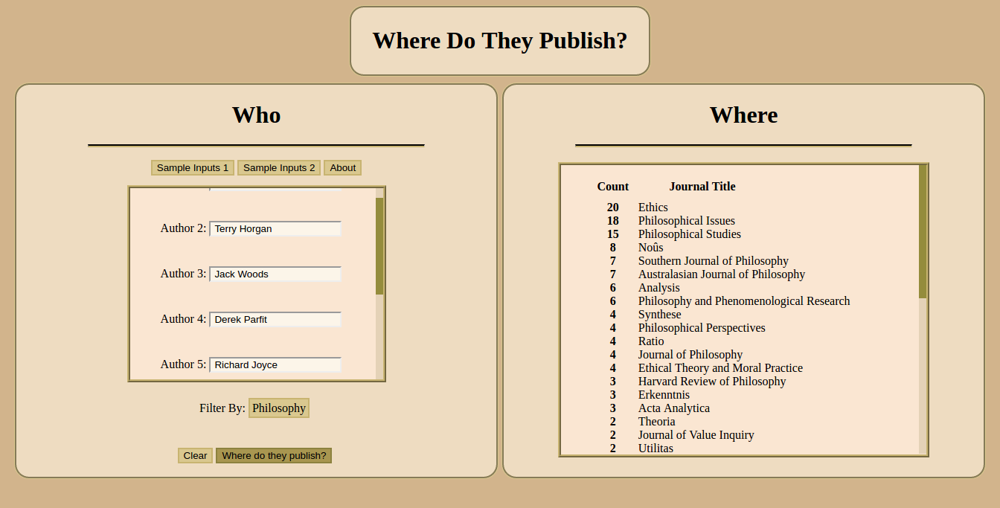

# Where do they publish?

*Flexible Citation-Based Journal Rankings*

[Live](http://wheredotheypublish.derekshiller.com)




## Aspiration

  This project is motivated by a dissatisfaction with current methods for ranking academic journals. In short, the problem is that there is no appropriate objective means to compare journals that excel in different ways. Journals cannot be ranked independently of the subjective values of the ranker.

  This project aims to rectify this problem by ranking journals based on the the interests and values of the ranker, as captured by a list of the ranker's admired academics. The ranking produced should reflect the ideals of scholarship embodied by those academics.

  While ideally the system for doing this should ultimately rely on citations, there is little available data. Instead, this project ranks journals based solely on publication numbers. It isn't a prestige ranking, but is instead intended to capture something about the styles embodied by different journals.

## Current Features

  The project is at a preliminary stage. Currently, it is focused on academic philosophy and utilizes the [PhilPapers](http://www.philpapers.org) search engine.

  The app counts journals by number of publication of the input authors. Given a list of authors, it will output a ranking of journal by number of publications by those authors.

## Implementation

  The app is written in Go and vanilla JavaScript. When a user inputs authors and clicks on the search button, an ajax request is sent to the Go program on the back end, which in turn queries PhilPapers.org for the appropriate authors. The response received from PhilPapers is a plain text list of authors and publications. This needs to be parsed for journal titles.

  ```go
  func parseSinglePub ( entryStr string ) ( nextPub publication ) {
    journalReg := regexp.MustCompile("[[:space:]][_].*[_][[:space:]]")
    journal := journalReg.FindAllString(entryStr, -1)
    if len(journal) == 0 {journal = []string{""}}
    journalStr := strings.Trim(journal[0], ")._ ")
    nextPub = publication{Journal: journalStr}
    return nextPub
  }
```

The list is parsed and the journal titles are counted and sorted, then returned to the front end to be printed in the response panel.
